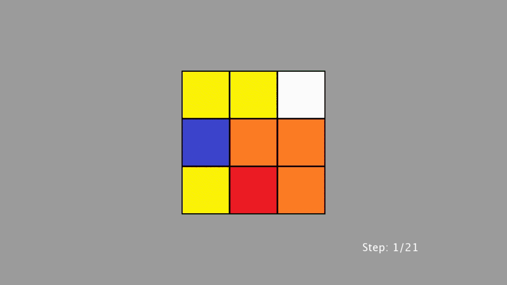
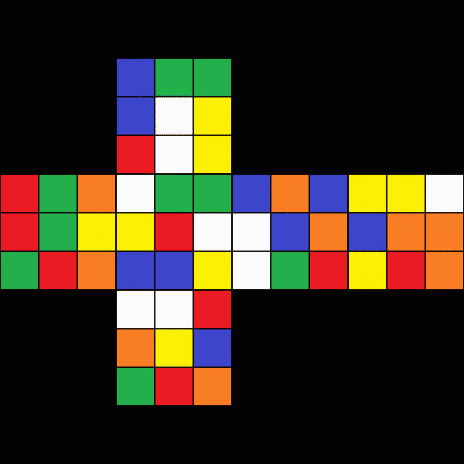

# Rubik's Cube



## Breakdown

This is a sketch created for a course assignment using Processing to showcase its ability to manipulate images in 3D space.

In this program, the user controls the cube with a mouse. As the user moves the mouse cursor from left to right on the width of the screen, each side of the cube changes its image to indicate that it is turning. The user may press any key on the keyboard to stop the cube from solving itself and therefore view the cube at the current step; a mouse click will resume solve.

The first thing I did to create this program was to look for any scramble that could be solved in the least number of steps (as I wanted to minimize the time it took me to recreate each side in Paint). Next, in order to conveniently load images when running the program, I named each image file in this form:

`[face color][step number].[file extension]`

The setup is done and it's time to load the images into the program.

```java
for (int i = 0; i < numberOfSteps; i++)
{
    loadWhite[i] = loadImage("white" + (i + 1) + ".jpg");
    loadYellow[i] = loadImage("yellow" + (i + 1) + ".jpg");
    loadRed[i] = loadImage("red" + (i + 1) + ".jpg");
    loadOrange[i] = loadImage("orange" + (i + 1) + ".jpg");
    loadGreen[i] = loadImage("green" + (i + 1) + ".jpg");
    loadBlue[i] = loadImage("blue" + (i + 1) + ".jpg");
}
```

Instead of a cube, the program creates six planes of images, and it iterates through an array of loaded images when the player moves the mouse at a certain point.

